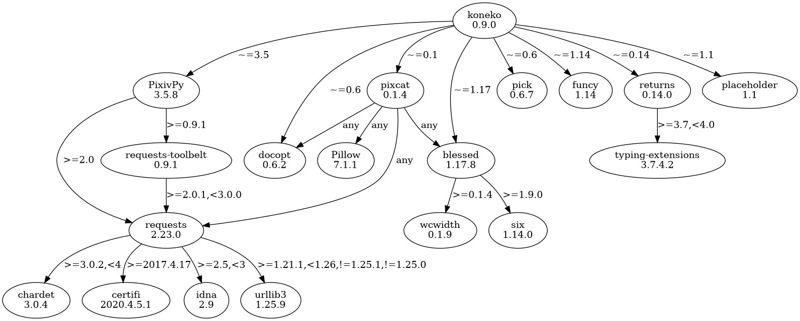

# Hacking

## Pure and impure modules

|          | Pure | Impure
| -------- | ---- | ---
| Frontend |      | <ul><li>main</li><li>prompt</li><li>ui</li><li>lscat_app</li><li>screens</li></ul>
| Backend  | <ul><li>colors</li><li>data</li><li>pure</li></ul> | <ul><li>api</li><li>cli</li><li>config \*</li><li>files</li><li>download</li><li>lscat</li><li>printer</li><li>utils</li></ul>

* 'Pure' means functions are referentially transparent and globally pure (mutations may happen in local scope)
* 'Frontend' means interacts with user (and catch and process user inputs)
* 'Backend' means everything else
* (Ideally the) 'backend' does work, 'frontend' organises work (if otherwise, please open an issue or make a PR).

\* Config has impure IO functions, safe functions that will return defaults on failure, and interactive functions


## Cache directory structure

```sh
$ cd ~/.local/share/koneko
$ tree -d  # (Edited: .koneko and history are files not directories)
.
├── cache                     # ├── KONEKODIR
│   ├── 2232374               # │   ├── Artist pixiv ID                             ├── Mode 1 and 2
│   │   ├── 1                 # │   │   ├── Page 1                                  │   ├── Mode 1
│   │   ├── 2                 # │   │   ├── Page 2                                  │   ├── Mode 1
│   │   └── individual        # │   │   └── Posts with a single image               │   └── Mode 2
│   │       └── 76695217      # │   │       └── ID of posts with multiple images    │       └── Mode 2

│   ├── following             # │   ├── Following users mode                        ├── Mode 3
│   │   └── *your_id*         # │   │   └── Your pixiv ID                           │
│   │       ├── 1             # │   │       ├── Page 1                              │
│   │       │   └── .koneko   # │   │       │   └── Stores number of artists info   │
│   │       └── 2             # │   │       └── Page 2                              │
│   │           └── .koneko   # │   │           └── Stores number of artists info   │

│   ├── illustfollow          # │   ├── Illust follow mode                          ├── Mode 5
│   │   ├── 1                 # │   │   ├── Page 1                                  │
│   │   └── 2                 # │   │   └── Page 2                                  │

│   ├── search                # │   ├── Search users mode                           ├── Mode 4
│   │   └── gomzi             # │   │   └── Search string
│   │       └── 1             # │   │       └── Page 1

│   ├── history               # │   ├── History file, for frequent "mode"

│   ├── testgallery           # │   ├── (Internal/debugging use)
│   └── testuser              # │   └── (Internal/debugging use)
└── pics                      # └── Images for main and info screen
```


## UML diagrams

### Flowchart of modes and their connections:


### Simplified UML diagram of the classes:

![Classes UML](http://plantuml.com:80/plantuml/png/rLXDRzms4BthLmZenTwrXDnoCOm4ATowQD4WRdef2e8hZNPfSqMLekmOxlxt3abH8YLAILi3QGCa23cS3xuPlXdjcrPHgReZJnB558VqNjHmBvA4xbebQQ7IWjEsJO-KrVdRVkz78PhqylBixKKgeJo_kdfEKlopDRREpiqYUtOMJgIHujWeqabEX2IiT4Uqe82s7IHrqmtwv85oLb85uRPdTY-84kGeIa3XAKdyIALYhVe9HIPM6r-UtnmR3aUeLPldOmZnsARM6rhSqpqO-xr1iRi3H8XnthMAL89pyMWq24UlMYa2MzOrMIp8XRE_7LXPGlrxjkXccggE3LO-taJIbESVu8-EuLPAbP9irobmSAGZl2bYJwSAEpZG1oOwwHJ6y_euCH7CKwN_lGSv5xG7l0ghiN3gI8ORzeazIFGDRKIAVvceoGug8G7p21MeuX2n8bcjI8EvGq-Lw0_a-JjnF8fwTgMWYhSrVBAwRWFzF31uzFUmYAXiWT2w9ALuhBcWVedRkCZCaeJ-u6ajXTzHpa4-HVCuB-SnQTay7vCinB1VntG9oOyrmnmv_0myxEZZiqF7xjfZOWu868V-1Sx5pnYPOiNf0BmnA4qA-q_pakPGEIBG4lF2F0ZVNQJ54wrNCIIHijl6OmqZZ82HfOIQ64ZNWgONlCOGtOrvqDVcFN_56BV8T7sGUni5AOIGfQkRYBpkZYOZ4HhRPFe9P3FqasI1lpo522194diB_qfb4fRNDNx5odqlNh9lMFMV7q1ALaAW7Mjyfw7BT2piCPPpC3PZsPUKh6quVR8lBYWllH4hgAqZgU2LRaK3TRXZA2lOCUmdkZRSDKnITPmJ2KFLt7N7HYFXKnu7-Z2oWZwnpfEVww3JX2NnDERvrHJ0S6bEECYI0D4rqMMUH_d7hobRcgpUVqG2QBzQPLdXRAGw-Q7U0fN5uONZFArdC0xFkauaJe_pGujX_QzUPyweCpBN9Eu_CI-IbtNKT3lE2gQU-lKJpYUsUwmCUowC_ycSCBQLeLG-r-7D5PFvdKTo3xE_UjHBNh9IYvj5uql5k8dxc4rvl2se6kBxnQ8UIM0mbMDZriPc-tkeGL8bf0MtQ_Gx7vuafg_1Pk6zUElSEFssRmVjIjM6VaTdQ-RqjV-HoMG1cMpHpQA6PFk3Ykiby-hOv3fp-RARo6InoJbKQi738Yp-bztLWhAR1IpHXlE06IUjmDzs0zfSOZgMspS2pqHgAjOBQCQ_HYEq_eLAlkClK34wiM_uZIQ3B7R3UDFlpmVt7aulTELDfdEPPJDu5_lZeiR2jBjmZTCmD6WwpllQ-g4LxgU6RMhe50VlVgaZGefLXtwD6ePnMrBGuW3zhgYg5bI_6CQ-YHfsyDPRrlG8Rcs6CPJtouh9La-4-mZ9RCCFdGNIJujEIcG1Ol7f_PX1x0vlwspPh0rMjXY2nrq68pEG1GWv9NSN6q-VY65xWgDPUWYWP8SN49L5SmKwwwvY73HY0q8Sl3Fz1BttC7G0w9tWGhgm_ax6MHdcskJjFvvztpfEqamr0aS5TryfD7mu81L-L1Pdiu7FPFO--WSLcSCdPJ8Ux6Vv0FIv6TUrROfeWvBtDz-RRspTfTEpsujlhgzVltxrwZozHIhXeD2EF_lLJ37AKoxso1wkww6XyNy4mUd0Mwk31EfAjS0f04i5RVHO13zDqKVA53761xW_sB7IzTXj-Dq-ViK9XJq1IlSuIb2KSIUk73dQR4v-PMWD2qP58UTDXADJxpSo_TDN26oM6KRrUaGm52R96wXB_NlrNm00)


### Actor-ish model of the ui.AbstractUI class
  

  
### Actor-ish model of the ui.Gallery classes (extending AbstractUI)


### Actor-ish model of the ui.User classes (extending AbstractUI)
  


### Actor-ish model of the ui.Image class


### Functions in download.py


## Dependencies

There are two dependencies that aren't necessary: returns and placeholder (both on the right edge). Code can always be rewritten to remove those two dependencies. That said, they don't introduce their own dependency tree, so only a total of three dependencies are added. Compared to the core dependencies (pixivpy, pixcat, and blessed), that's insignificant.



```sh
$ pipdeptree -v
2.0.0b1
$ pipdeptree --graph-output png -p koneko > dependencies.png
```

