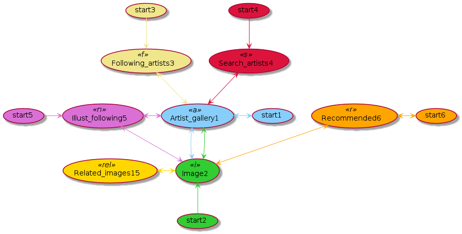
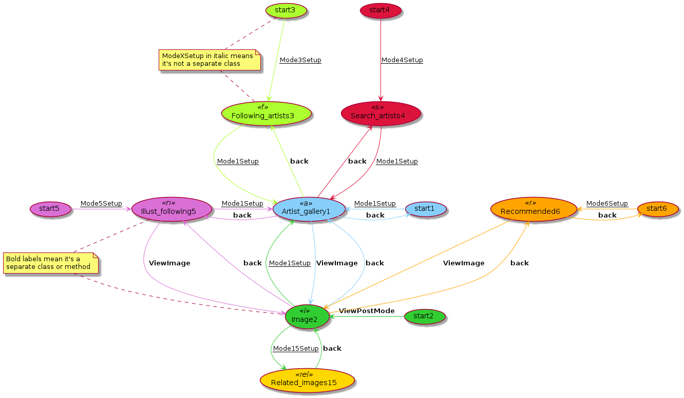
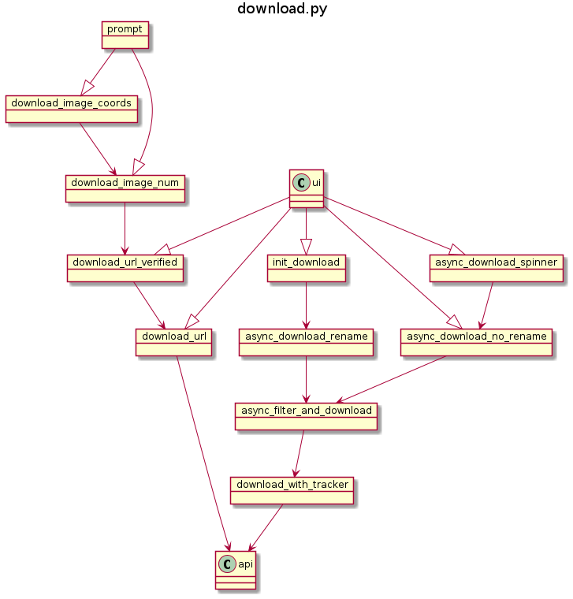
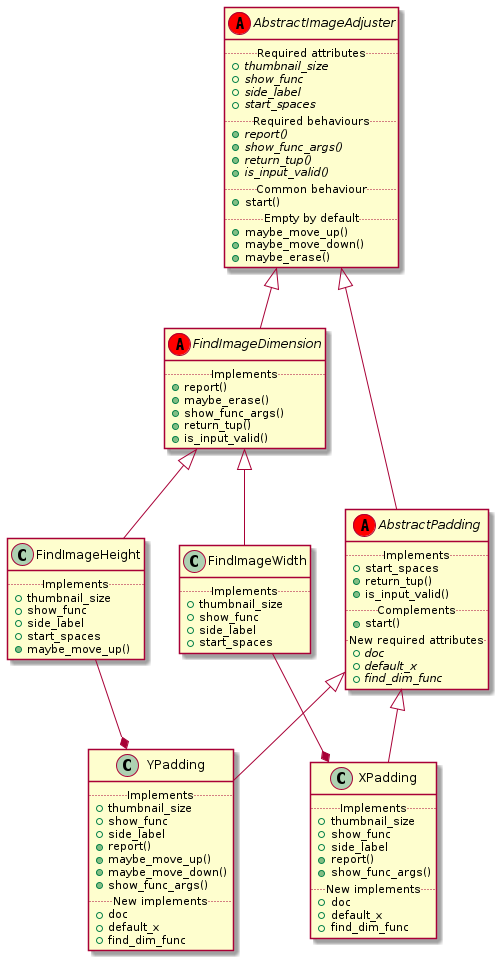
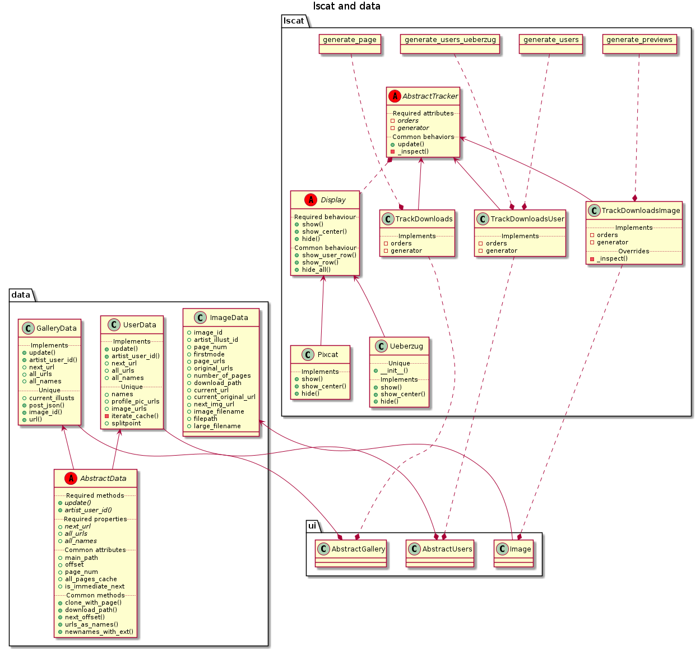
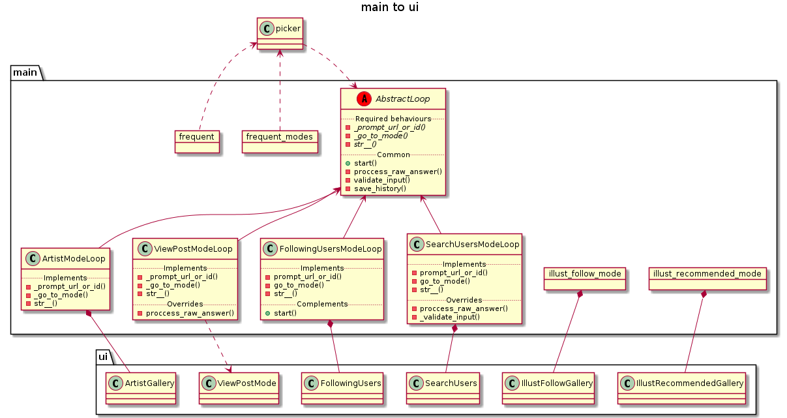
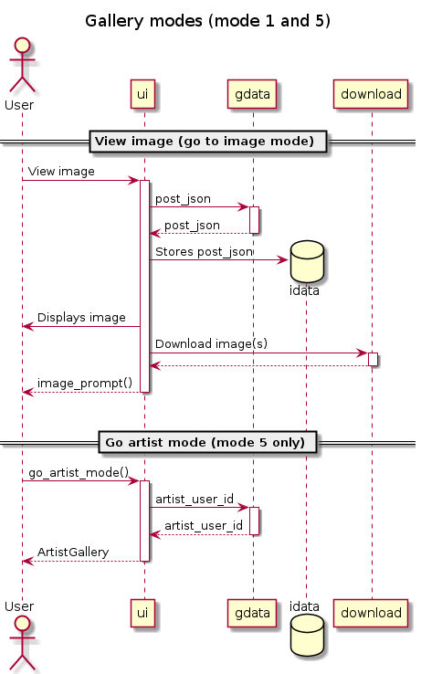
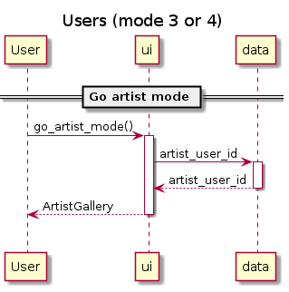
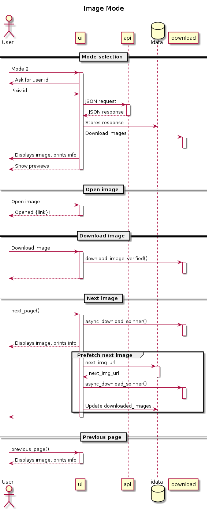
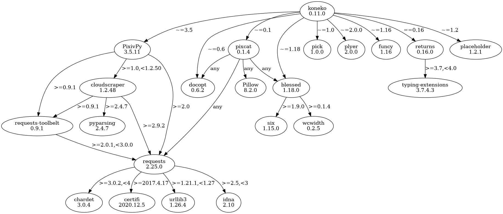

> Developer guide to the codebase

## Contents

- [Cache directory structure](#cache-directory-structure)
- [UML diagrams](#uml-diagrams)
    - [Flowchart of modes and their connections](#flowchart-of-modes-and-their-connections)
    - [Simplified UML diagram of the classes](#simplified-uml-diagram-of-the-classes)
        - [api.py](#apipy)
        - [download.py](#downloadpy)
        - [Image Adjuster in assistants.py](#image-adjuster-in-assistantspy)
        - [lscat.py and data.py](#lscatpy-and-datapy)
        - [main.py to prompt.py](#mainpy-to-promptpy)
        - [main.py to ui.py](#mainpy-to-uipy)
        - [ui.py](#uipy)
        - [UI class methods](#ui-class-methods)
    - [Actor-ish models of ui classes](#actor-ish-models-of-ui-classes)
        - [ui.AbstractUI](#uiabstractui)
        - [ui.Gallery classes (extending AbstractUI)](#uigallery-classes-extending-abstractui)
        - [ui.User classes (extending AbstractUI)](#uiuser-classes-extending-abstractui)
        - [ui.Image](#uiimage)
- [Dependencies](#dependencies)

## Cache directory structure

```sh
$ cd ~/.local/share/koneko
$ tree -d  # (Edited: .koneko and history are files not directories)
.
├── cache                         # ├── KONEKODIR
│   ├── 2232374                   # │   ├── Artist pixiv ID                             ├── Mode 1 and 2
│   │   ├── 1                     # │   │   ├── Page 1                                  │   ├── Mode 1
│   │   ├── 2                     # │   │   ├── Page 2                                  │   ├── Mode 1
│   │   └── individual            # │   │   └── Posts with a single image               │   └── Mode 2
│   │       └── 76695217          # │   │       └── ID of posts with multiple images    │       ├── Mode 2
│   │           └── illustrelated # │   │       └── Related images mode                 │       └── Mode 1.5
│   │               └── 1         # │   │           └── Page 1                          │           └── Mode 1.5

│   ├── following                 # │   ├── Following users mode                        ├── Mode 3
│   │   └── *your_id*             # │   │   └── Your pixiv ID                           │
│   │       ├── 1                 # │   │       ├── Page 1                              │
│   │       │   └── .koneko       # │   │       │   └── Stores number of artists info   │
│   │       └── 2                 # │   │       └── Page 2                              │
│   │           └── .koneko       # │   │           └── Stores number of artists info   │

│   ├── illustfollow              # │   ├── Illust follow mode                          ├── Mode 5
│   │   ├── 1                     # │   │   ├── Page 1                                  │
│   │   └── 2                     # │   │   └── Page 2                                  │

│   ├── recommended               # │   ├── Illust recommended mode                     ├── Mode 6
│   │   └── 1                     # │   │   └── Page 1

│   ├── search                    # │   ├── Search users mode                           ├── Mode 4
│   │   └── gomzi                 # │   │   └── Search string
│   │       └── 1                 # │   │       └── Page 1

│   ├── history                   # │   ├── History file, for frequent "mode"

│   ├── testgallery               # │   ├── (Internal/debugging use)
│   └── testuser                  # │   └── (Internal/debugging use)
└── pics                          # └── Images for main and info screen
```


## UML diagrams

### Flowchart of modes and their connections




### Flowchart as a finite state machine




### Simplified UML diagram of the classes

#### api.py


#### download.py



#### Image Adjuster in assistants.py



#### lscat.py and data.py



#### main.py to prompt.py


#### main.py to ui.py




#### ui.py


#### UI class methods


### Actor-ish models of ui classes
#### ui.AbstractUI
  

  
#### ui.Gallery classes (extending AbstractUI)




#### ui.User classes (extending AbstractUI)
  



#### ui.Image




## Dependencies

There are two dependencies that aren't necessary: returns and placeholder (both on the right edge). Code can always be rewritten to remove those two dependencies. That said, they don't introduce their own dependency tree, so only a total of three dependencies are added. Compared to the core dependencies (pixivpy, pixcat, and blessed), that's insignificant.



```sh
$ pipdeptree -v
2.0.0b1
$ pipdeptree --graph-output png -p koneko > dependencies.png
```
