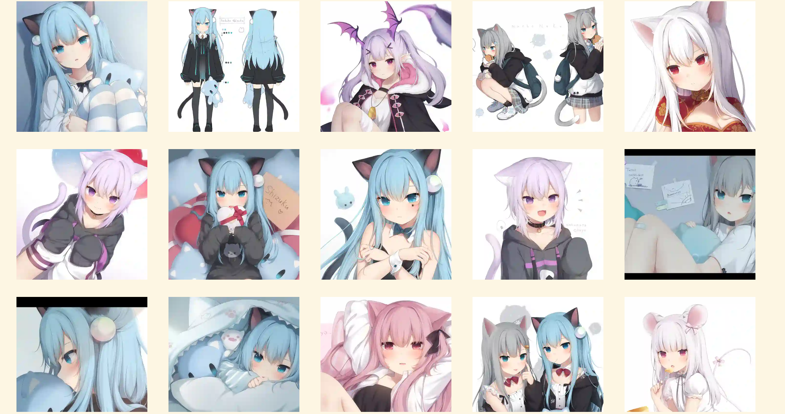
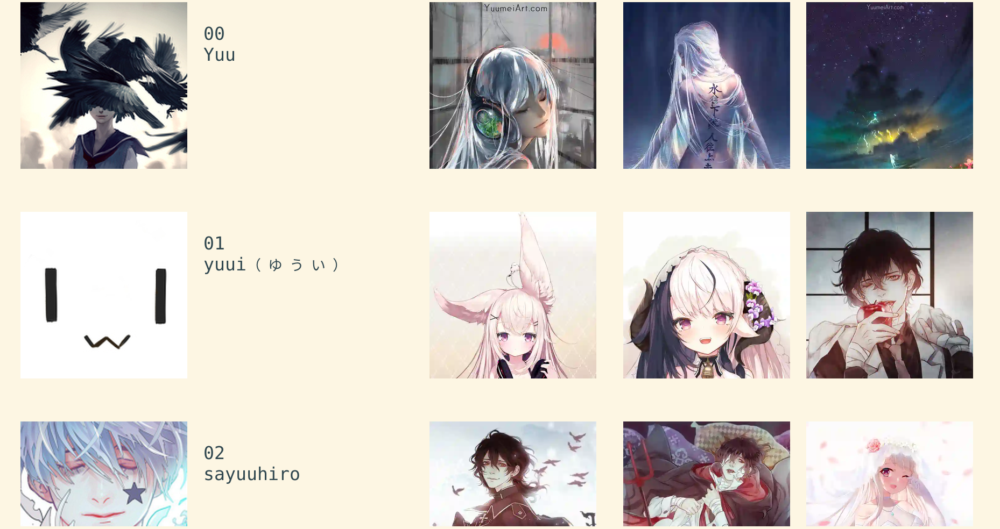
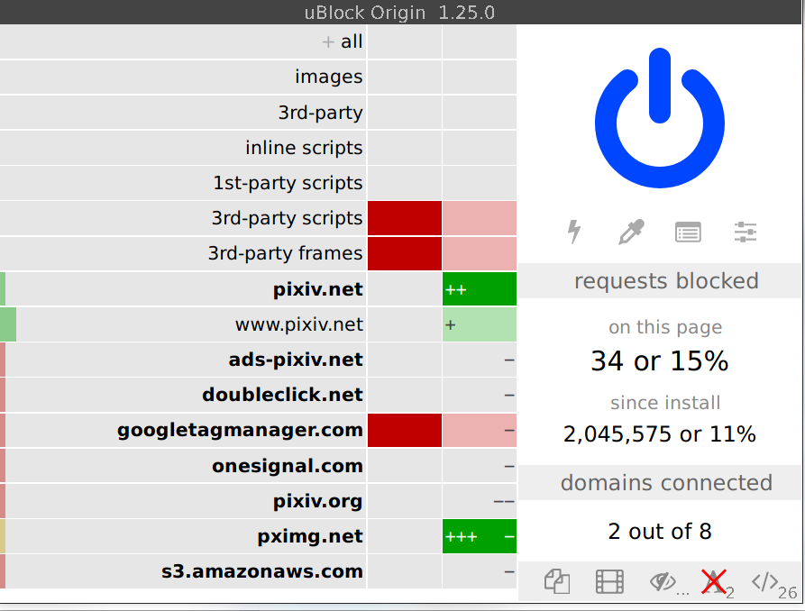

# koneko

[](https://www.gnu.org/licenses/gpl-3.0.txt) [](https://pypi.org/project/koneko/) [](https://GitHub.com/twenty5151/koneko/commit/)  [](https://koneko.readthedocs.io/en/latest/?badge=latest)

> Browse pixiv in the terminal using kitty's icat to display images (or use ueberzug)

Gallery view


Image view

Artist search (artist profile picture on the left, 3 previews on right)

View artists you're following


Requires [kitty](https://github.com/kovidgoyal/kitty). It uses the magical `kitty +kitten icat` 'kitten' to display images. For more info see the [kitty documentation](https://sw.kovidgoyal.net/kitty/kittens/icat.html). Actually, `lscat.py` uses [pixcat](https://github.com/mirukana/pixcat), which is a Python API for icat.

*New in version 0.11.0: [ueberzug](https://github.com/seebye/ueberzug) is now supported as an experimental feature, enable through the config file.*

**Why the name Koneko?** Koneko (こねこ) means kitten, which is what `icat` is, a kitty `+kitten`


## Features (what?)
See the [manual](MANUAL.md) for more details

1. View artist illustrations ([ex](https://www.pixiv.net/bookmark.php?type=user))
2. View a post ([ex](https://www.pixiv.net/en/artworks/78823485))
    - View related images suggested by pixiv (ex: scroll down from the above example)
3. View the artists that you are following (or any other user ID) ([ex](https://www.pixiv.net/bookmark.php?type=user))
4. Search for an artist/user ([ex](https://www.pixiv.net/search_user.php?nick=raika9&s_mode=s_usr))
5. View new illustrations from all the artists you are following ([ex](https://www.pixiv.net/bookmark_new_illust.php))
6. View recommended illustrations (now called 'discovery') ([ex](https://www.pixiv.net/discovery))


* Navigate between next and previous pages/images
* Download images ([PixivUtil](https://github.com/Nandaka/PixivUtil2/) would be more suitable for batch download) in full resolution
* Open post in browser
* Browse an offline cache


## Why?
* Terminal user interfaces are minimalist, fast, and doesn't load Javascript that slows down your entire browser or track you
    * Image loading is *so* much faster, especially if you don't delete the cache

I get 32 trackers on Pixiv. Plus, you have to disable ublock if you ever get logged out

<a href="url"></a>

The mobile app even directly tells you Google "and our 198 partners" "collect and use data"! See [prompt 1](https://raw.githubusercontent.com/twenty5151/koneko/master/docs/pics/ads1.png), [prompt 2](https://raw.githubusercontent.com/twenty5151/koneko/master/docs/pics/ads2.png) and this [list](#trackers-avoided) of trackers

* TUIs make you cool
* TUIs *with embedded pictures* make you even cooler
* TUIs embedded with pictures of cute anime girls make you the coolest
* Keyboard driven
* Familiar, vim-like key sequences
* I use arch btw


## Installation (how?)
See also: [manual installation](CONTRIBUTING.md#manual-installation)

0. If you want to use the stable api, install [kitty](https://github.com/kovidgoyal/kitty) (Otherwise, you can use ueberzug with your current terminal, however note that it doesn't seem to work on macOS)
    * If using ueberzug, run `pip install ueberzug` first
1. `pip install koneko` (or if you use [conda](CONTRIBUTING.md#conda-environment)...)
2. Run `koneko`. It will open a pixiv login page in your default browser and quit.
3. Login to pixiv on your browser. If prompted, open the `pixiv://` link with "koneko pixiv login handler". If successful you should see a notification saying "Login finished!". If not, make a bug report at https://github.com/twenty5151/koneko/issues/
4. Run `lscat 1 7` to help setup the recommended settings; copy to `~/.config/koneko/config.ini`. (Don't skip this step! Image display in the terminal is very sensitive to your config!)
5. Run `koneko` again. Hopefully you don't see any error messages about login failing. See [usage](#usage) for how to use.

### Requirements

* Python 3.8+
* It has been tested on kitty v0.17.2 onwards, but should work on older versions
* Operating system: all OSes that kitty supports, which means Linux and macOS.
    * Ueberzug only works on linux
* Dependencies on external programs (your responsibility to install them):
    - `xdg-open` (linux) or `open` (mac) for opening links in your browser
    - `curl` for safety fallback (not necessarily needed), see below
    - `xdg-mime` and `update-desktop-database` to handle the pixiv login callback
        - For `update-desktop-database`, try install the `desktop-file-utils` package with your package manager

<details>
  <summary>If it crashes (it shouldn't), it might be because pip didn't 'install' the welcome pictures, *and* the script failed to download them for some reason. Try:</summary>

```sh
mkdir -p ~/.local/share/koneko/pics
   
curl -s https://raw.githubusercontent.com/twenty5151/koneko/master/pics/71471144_p0.png -o ~/.local/share/koneko/pics/71471144_p0.png
    
curl -s https://raw.githubusercontent.com/twenty5151/koneko/master/pics/79494300_p0.png -o ~/.local/share/koneko/pics/79494300_p0.png
 ```
</details>

## Usage and manual

See the [MANUAL.md](MANUAL.md)


## FAQ
### I'm having problems with lscat

For the best experience use the terminal in full screen, unless your screen is big enough. Moving and resizing it abruptly will not be good for icat, which is really kitty's problem not mine. Extra information can be disabled from being printed.

You can also use versions less than v0.5.1, which retains legacy support for the original lsix shell script. Note that I've never really tested it, which is why I decided to be honest and depreciated legacy support from v0.6 onwards. The current lscat API has matured to the point where it's simple to write a replacement anyway.

### I'm having problems logging in

Try these steps in order:

- Update your system and reboot. No seriously, that's what worked for me.
- Try a different browser
- Set said different browser as your default browser
- Make a bug report at https://github.com/twenty5151/koneko/issues/ for support and debugging
- Use the original script [here](https://gist.github.com/ZipFile/c9ebedb224406f4f11845ab700124362) to get your refresh token. Copy the example config to `~/.config/koneko`, and add the line `refresh_token=XXXX` under the `[Credentials]` section.

## Contributing

See [CONTRIBUTING.md](CONTRIBUTING.md)


## Upcoming changelog for version 0.12

For full changelogs please see [releases](https://github.com/twenty5151/koneko/releases)

### Features
* Remove the need to ask for your pixiv user ID; koneko will now get it from the API response
    * Custom user ID for mode 3 (view following users) has thus been removed, to reduce complexity of first-time setup

### Bug fixes
* Fixed broken pixiv login
* Fixed broken curl fallback commands in the .rst version

### Code maintenance
* Update dependencies
* Unit tests: Use tmp_path fixture instead of manually creating paths
* Replace FollowingUserModeLoop class with following_user_mode function
* Removed integration tests due to unreliability of new pixiv login method
* Simplified the README


## Trackers avoided
<details>
<summary>This is a list of trackers present when you use the official pixiv website or app. koneko frees you from them.</summary>

Nine trackers in the Android app, according to [exodus](https://reports.exodus-privacy.eu.org/en/reports/jp.pxv.android/latest/):

* Amazon Advertisement
* AMoAd
* Google Ads
* Google CrashLytics
* Google DoubleClick
* Google Firebase Analytics
* Integral Ad Science
* Moat
* Twitter MoPub

Advertisers from pixiv's [privacy policy](https://policies.pixiv.net/en.html#booth):

* Looker
* Repro
* Qualaroo
* DDAI（Date Driven Advertising Initiative）
* YourAdChoices
* Rubicon Project
* i-Mobile Co., Ltd.
* Akinasista Corporation
* Axel Mark Inc.
* AppLovin
* Amazon Japan G.K.
* AmoAd Inc.
* AOL Platforms Japan K.K.
* OpenX
* Google Inc.
* CRITEO K.K.
* CyberAgent, Inc.
* Geniee, Inc.
* Supership Inc.
* GMO AD Marketing Inc.
* F@N Communications, Inc.
* Facebook Inc.
* Fluct, Inc.
* Platform One Inc.
* MicroAd Inc.
* MoPub Inc.
* Yahoo! Japan Corporation
* United, Inc.
* 株式会社Zucks
* PubMatic, Inc.
* Liftoff Mobile, Inc.
* Mobfox US LLC
* OneSignal
* Smaato, Inc.
* SMN株式会社
* 株式会社アドインテ
</details>
