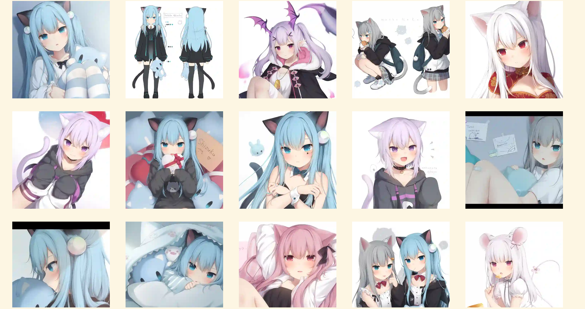
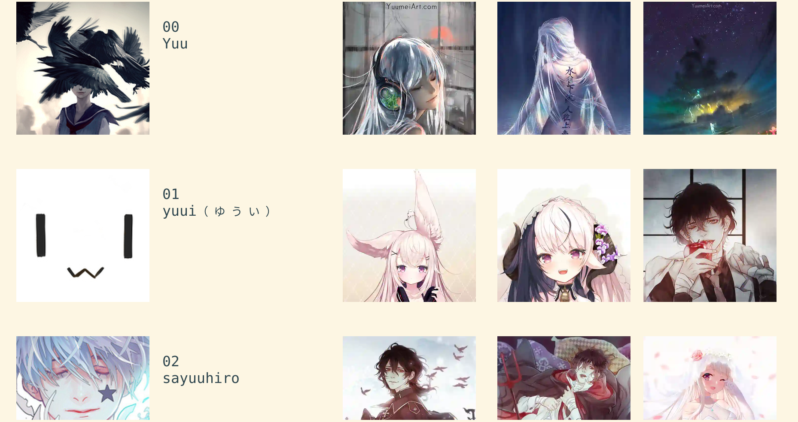
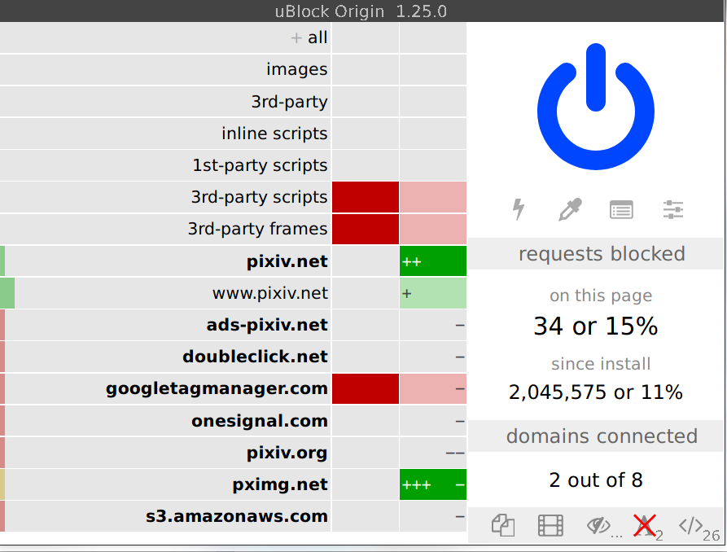

# koneko

[](https://www.gnu.org/licenses/gpl-3.0.txt) [](https://pypi.org/project/koneko/) [](https://GitHub.com/twenty5151/koneko/commit/) []()  

> Browse pixiv in the terminal using kitty's icat to display images (in the terminal!)

Gallery view


Image view

Artist search (artist profile picture on the left, 3 previews on right)

View artists you're following


Requires [kitty](https://github.com/kovidgoyal/kitty). It uses the magical `kitty +kitten icat` 'kitten' to display images. For more info see the [kitty documentation](https://sw.kovidgoyal.net/kitty/kittens/icat.html). Actually, `lscat.py` uses [pixcat](https://github.com/mirukana/pixcat), which is a Python API for icat.

**Why the name Koneko?** Koneko (こねこ) means kitten, which is what `icat` is, a kitty `+kitten`


# Features
See the [manual](MANUAL.md) for more details

1. Artist illustrations gallery ([ex](https://www.pixiv.net/bookmark.php?type=user))
    * Enter the post's coordinates to open it in image view. Coordinates are in the form `xy` where x is column and y is row.
    * Next and previous pages
2. Image view ([ex](https://www.pixiv.net/en/artworks/78823485))
    * View an image in large resolution
    * Browse through different images in a multi-image post.
3. View artists you are following ([ex](https://www.pixiv.net/bookmark.php?type=user))
4. Search for an artist ([ex](https://www.pixiv.net/search_user.php?nick=raika9&s_mode=s_usr))
5. View new illustrations from all the artists you are following ([ex](https://www.pixiv.net/bookmark_new_illust.php))
* Both gallery and image views can:
    * Download an image([PixivUtil](https://github.com/Nandaka/PixivUtil2/) would be more suitable for batch download) in full resolution
    * Open post in browser


# Rationale
* Terminal user interfaces are minimalist, fast, and doesn't load Javascript that slows down your entire browser or track you
    * Image loading is *so* much faster, especially if you don't delete the cache

I get 32 trackers on Pixiv. Plus, you have to disable ublock if you ever get logged out

<a href="url"></a>

The mobile app even directly tells you Google "and our 198 partners" "collect and use data"! See [prompt 1](https://raw.githubusercontent.com/twenty5151/koneko/master/pics/ads1.png), [prompt 2](https://raw.githubusercontent.com/twenty5151/koneko/master/pics/ads2.png) (Github can't render the images correctly for some reason) and this [list](#trackers-avoided)

* TUIs make you cool
* TUIs *with embedded pictures* make you even cooler
* TUIs embedded with pictures of cute anime girls make you the coolest
* Keyboard driven
* Familiar, vim-like key sequences
* I use arch btw


# Installation
See also: [manual installation](#manual-installation)

0. Install [kitty](https://github.com/kovidgoyal/kitty)
1. `pip install koneko` (or if you use [conda](CONTRIBUTING.md#conda-environment)...):
2. Run `koneko`

## Requirements

* Python 3.8+
* It has been tested on kitty v0.17.2 onwards, but should work on older versions
* Operating system: all OSes that kitty supports, which means Linux and macOS.

<details>
  <summary>If it crashes (it shouldn't), it might be because pip didn't 'install' the welcome pictures, *and* the script failed to download them for some reason. Try:</summary>

```sh
mkdir -p ~/.local/share/koneko/pics
   
curl -s https://raw.githubusercontent.com/twenty5151/koneko/master/pics/71471144_p0.png -o ~/.local/share/koneko/pics/71471144_p0.png
    
curl -s https://raw.githubusercontent.com/twenty5151/koneko/master/pics/79494300_p0.png -o ~/.local/share/koneko/pics/79494300_p0.png
 ```
</details>

# Usage
Launch with `koneko`. There are five modes of operation:
1. View artist illustrations ([ex](https://www.pixiv.net/bookmark.php?type=user))
2. View a post ([ex](https://www.pixiv.net/en/artworks/78823485))
3. View the artists that you are following (or any other user ID) ([ex](https://www.pixiv.net/bookmark.php?type=user))
4. Search for artist/user ([ex](https://www.pixiv.net/search_user.php?nick=raika9&s_mode=s_usr))
5. View newest illustrations from artists you're following ([ex](https://www.pixiv.net/bookmark_new_illust.php))

Enter digits 1-5 to proceed. If prompted, paste in an appropriate pixiv ID or url. See below for url examples.

Alternatively, you can supply a pixiv url as a command line argument, bypassing the first interactive prompt. The pixiv url must be either the url of the artist's page, or a pixiv post. Example:

```sh
koneko https://www.pixiv.net/en/users/2232374 # Mode 1
koneko https://www.pixiv.net/en/artworks/78823485 # Mode 2
koneko f https://www.pixiv.net/en/users/2232374 # Mode 3
koneko "raika9" # Mode 4
koneko 5 # Mode 5
```
For more details refer to the [manual](MANUAL.md#Usage). You might also want to look at [how to configure](MANUAL.md#Configuration) the display settings according to your terminal size.

## Upcoming changelog (in dev branch)

For full changelogs please see [releases](https://github.com/twenty5151/koneko/releases)

### Version 0.8

* lscat now slightly faster as the image number is calculated only when it finishes downloading, not on every recursion.
* Improvement for lscat: the screen will be filled with the most rows as possible
* HACKING.md split from CONTRIBUTING.md to better assist other developers
* Image view can now preview the next four images in multi-image posts (need to enable its experimental flag)

#### Fixed
* Fixed opening the manual in user modes not working
* Fixed bug in lscat: number of columns now determines when to print page spacings

#### Code maintenance
* Extract out common behaviour from Gallery and Users ui classes into AbstractUI
    * Gallery classes is now structued like Users. The most significant difference is the use of `offset` to prefetch and navigate pages.
    * Unified API requests for each mode
* Simplified code everywhere
    * Reduced nesting with early returns
    * Removed dead code
    * Split up functions in:
        * `config.py`
        * `main.py`
        * `cli.py`
        * `download.py`
    * Renamed data classes (eg GalleryJson to GalleryData)
    * Simplify `ui.display_page()`
    * Extract common code in `prompt.py`; follow a common structure
* Remove unused cytoolz dependency
* More functional style
    * Use `placeholder` to make lambdas look better
    * Use `pipey` for functional-style postfix pipes
    * Using `returns.result` Result container in `config.py` and `splitpoint`
* Make tests more professional
* Move functions around modules to better reflect (im)purity

# Roadmap

* In-depth usage documentation?
* Consistent public and private methods and attributes again

## Features

* Interactive helper UI to assist configuring lscat numbers.
    * Open up lscat to be launched via a seperate command, so you don't need to login to pixiv every time
* Show frequently searched IDs/strings with an option to select them.
* Show existing IDs in the cache and delete their directories.
* Offline mode for browsing the existing cache (opening up lscat will do most of this, only thing missing is to show frequent or existing dirs)
* Go to related works from image view (illust_related)
* View recommended illusts (illust_recommended)

## Known bugs
* illust follow mode seems to be not updating outdated images? Most reliable mitigation is to manually delete the folder
* Reloading then going back just redraws the current mode again, with possible instability
* There seems to be a delay between entering `koneko` and startup, but the delay is before the first line of the script even executes. Import time is fast. `pip install` using the wheel seems to reduce the delay.
* Does not cache the login cookies, so it logins to pixiv everytime, which might cause pixiv to send you emails. See below

# FAQ
* Pixiv keeps emailing me saying I've logged in, every time I use this app!

That's because cookies aren't stored so you log in everytime with a new session. Looking at [PixivUtil's cookie implementation](https://github.com/Nandaka/PixivUtil2/blob/master/PixivBrowserFactory.py), it would be easier to base this app on PixivUtil for downloads, than to write it myself (currently, it's based on the [pixivpy](https://github.com/upbit/pixivpy/) api). The problems with this, other than being a huge time and effort investment, is that koneko uses info from the requests, such as number of pages.
I'd like to fix this but I'd rather not use mechanize but I don't know how to do it either way.

* I'm having problems with lscat

For the best experience use the terminal in full screen, unless your screen is big enough. Moving and resizing it abruptly will not be good for icat, which is really kitty's problem not mine. Extra information can be disabled from being printed.

You can also use versions less than v0.5.1, which retains legacy support for the original lsix shell script. Note that I've never really tested it, which is why I decided to be honest and depreciated legacy support from v0.6 onwards. The current lscat API has matured to the point where it's simple to write a replacement anyway.

# Contributing
* Fork it
* Edit the files on your fork/branch
* Run tests with `pytest testing/ -vvvv -l -s` (`--inte` for integration tests)
* Submit a pull request

Tips: 
* If your git client complains about committing to master, just remove `.pre-commit-config.yaml`
* If you want to, you can create an issue first. Ask any questions by opening a new issue.
* If you're encountering/fixing a bug and you're stuck, try clearing the cache. For example, a bug might have downloaded to the wrong folder, but after fixing the bug, you need to clear the cache, otherwise it would not download anything and display the wrong contents.

See the rest in [CONTRIBUTING.md](CONTRIBUTING.md)

## Conda environment

See [CONTRIBUTING.md](CONTRIBUTING.md#conda-environment)

## Manual installation

See [CONTRIBUTING.md](CONTRIBUTING.md#manual-installation)

## Unit tests
Run `pytest testing/ -vvvv -l -s`. Add `--inte` for integration testing, but don't be surprised if it fails

## Build and upload to PyPI
When test installing with pip, don't forget to use `pip install .` or `python setup.py install`, not `pip install koneko` (which will grab from latest stable version). (Yes, I made the same mistake again)

Test installing with `pip install .`, `python setup.py install`, `python setup.py develop`, and `python -m koneko.main` is now automated.

Bump version info in `__init__.py`, `setup.py`, `README.md`, and `CONTRIBUTING.md`

```sh
python setup.py sdist bdist_wheel
twine upload dist/*
pip install koneko --upgrade
```

# Manual

For usage, see the [usage section](MANUAL.md#Usage). For configuration, see the [configuration section](MANUAL.md#Configuration)

# Trackers avoided
<details>
<summary>This is a list of trackers present when you use the official pixiv website or app. koneko frees you from them.</summary>

Nine trackers in the Android app, according to [exodus](https://reports.exodus-privacy.eu.org/en/reports/jp.pxv.android/latest/):

* Amazon Advertisement
* AMoAd
* Google Ads
* Google CrashLytics
* Google DoubleClick
* Google Firebase Analytics
* Integral Ad Science
* Moat
* Twitter MoPub

Advertisers from pixiv's [privacy policy](https://policies.pixiv.net/en.html#booth):

* Looker
* Repro
* Qualaroo
* DDAI（Date Driven Advertising Initiative）
* YourAdChoices
* Rubicon Project
* i-Mobile Co., Ltd.
* Akinasista Corporation
* Axel Mark Inc.
* AppLovin
* Amazon Japan G.K.
* AmoAd Inc.
* AOL Platforms Japan K.K.
* OpenX
* Google Inc.
* CRITEO K.K.
* CyberAgent, Inc.
* Geniee, Inc.
* Supership Inc.
* GMO AD Marketing Inc.
* F@N Communications, Inc.
* Facebook Inc.
* Fluct, Inc.
* Platform One Inc.
* MicroAd Inc.
* MoPub Inc.
* Yahoo! Japan Corporation
* United, Inc.
* 株式会社Zucks
* PubMatic, Inc.
* Liftoff Mobile, Inc.
* Mobfox US LLC
* OneSignal
* Smaato, Inc.
* SMN株式会社
* 株式会社アドインテ
</details>
