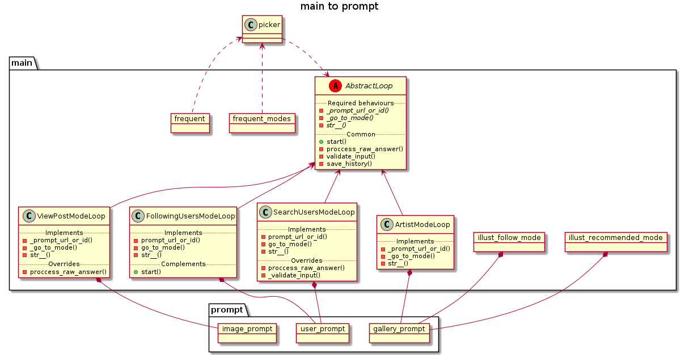
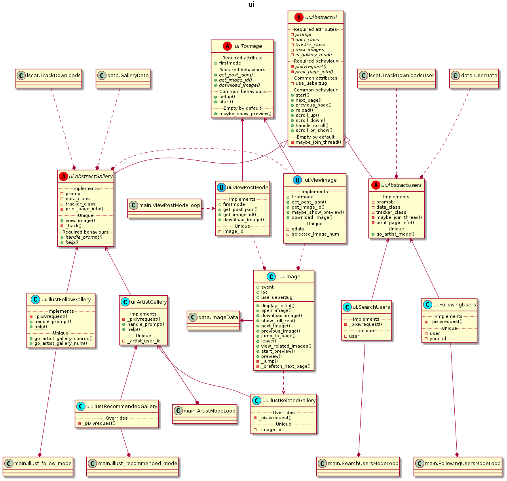

.. _hacking:

Hacking
=======

..

   Developer guide to the codebase

Cache directory structure
-------------------------

.. code-block:: sh

   $ cd ~/.local/share/koneko
   $ tree -d  # (Edited: .koneko and history are files not directories)
   .
   ├── cache                         # ├── KONEKODIR
   │   ├── 2232374                   # │   ├── Artist pixiv ID                             ├── Mode 1 and 2
   │   │   ├── 1                     # │   │   ├── Page 1                                  │   ├── Mode 1
   │   │   ├── 2                     # │   │   ├── Page 2                                  │   ├── Mode 1
   │   │   └── individual            # │   │   └── Posts with a single image               │   └── Mode 2
   │   │       └── 76695217          # │   │       └── ID of posts with multiple images    │       ├── Mode 2
   │   │           └── illustrelated # │   │       └── Related images mode                 │       └── Mode 1.5
   │   │               └── 1         # │   │           └── Page 1                          │           └── Mode 1.5

   │   ├── following                 # │   ├── Following users mode                        ├── Mode 3
   │   │   └── *your_id*             # │   │   └── Your pixiv ID                           │
   │   │       ├── 1                 # │   │       ├── Page 1                              │
   │   │       │   └── .koneko       # │   │       │   └── Stores number of artists info   │
   │   │       └── 2                 # │   │       └── Page 2                              │
   │   │           └── .koneko       # │   │           └── Stores number of artists info   │

   │   ├── illustfollow              # │   ├── Illust follow mode                          ├── Mode 5
   │   │   ├── 1                     # │   │   ├── Page 1                                  │
   │   │   └── 2                     # │   │   └── Page 2                                  │

   │   ├── recommended               # │   ├── Illust recommended mode                     ├── Mode 6
   │   │   └── 1                     # │   │   └── Page 1

   │   ├── search                    # │   ├── Search users mode                           ├── Mode 4
   │   │   └── gomzi                 # │   │   └── Search string
   │   │       └── 1                 # │   │       └── Page 1

   │   ├── history                   # │   ├── History file, for frequent "mode"

   │   ├── testgallery               # │   ├── (Internal/debugging use)
   │   └── testuser                  # │   └── (Internal/debugging use)
   └── pics                          # └── Images for main and info screen

UML diagrams
------------

Flowchart of modes and their connections
^^^^^^^^^^^^^^^^^^^^^^^^^^^^^^^^^^^^^^^^

.. image:: ../puml/flowchart/render/flowchart.png
   :target: ../puml/flowchart/render/flowchart.png
   :alt: Flowchart UML

Flowchart as a finite state machine
^^^^^^^^^^^^^^^^^^^^^^^^^^^^^^^^^^^

.. image:: ../puml/classes/render/state_flowchart.png
   :target: ../puml/classes/render/state_flowchart.png
   :alt: api UML

Simplified UML diagram of the classes
^^^^^^^^^^^^^^^^^^^^^^^^^^^^^^^^^^^^^

api.py
~~~~~~

.. image:: ../puml/classes/render/api.png
   :target: ../puml/classes/render/api.png
   :alt: api UML

download.py
~~~~~~~~~~~

.. image:: ../puml/classes/render/download.png
   :target: ../puml/classes/render/download.png
   :alt: download UML

Image Adjuster in assistants.py
~~~~~~~~~~~~~~~~~~~~~~~~~~~~~~~

.. image:: ../puml/classes/render/image_adjuster.png
   :target: ../puml/classes/render/image_adjuster.png
   :alt: image adjuster UML

lscat.py and data.py
~~~~~~~~~~~~~~~~~~~~

.. image:: ../puml/classes/render/lscat_and_data.png
   :target: ../puml/classes/render/lscat_and_data.png
   :alt: lscat and data UML

main.py to prompt.py
~~~~~~~~~~~~~~~~~~~~

main.py to ui.py
~~~~~~~~~~~~~~~~

.. image:: ../puml/classes/render/main_to_ui.png
   :target: ../puml/classes/render/main_to_ui.png
   :alt: main to ui UML

ui.py
~~~~~

UI class methods
~~~~~~~~~~~~~~~~

.. _classmethods:

Actor-ish models of ui classes
^^^^^^^^^^^^^^^^^^^^^^^^^^^^^^

ui.AbstractUI
~~~~~~~~~~~~~

ui.Gallery classes (extending AbstractUI)
~~~~~~~~~~~~~~~~~~~~~~~~~~~~~~~~~~~~~~~~~

.. image:: http://plantuml.com:80/plantuml/png/RL71QiCm3BthAtHCA3liq4iWeuD2Fw1iLwFL9dWuLh0LIY0VFzjnM3TwilJq93q_dQ9Ga7bq85QSmGivPyA28siJiSaFlY9vZSSMW6x20J-Y2G1zZv_MtD6ED1Xi1aRXckIk5liUCXDVtd2sU3Xq3tn8IC87JKAbD74KzHtPGp0o1_y0PCuNHOCsHt0BXcHFjZ4bxl2Qn2NHlvrRDOley6pZv6Y9V_Phldl7f8k4yvuKHXFRAcLNL60r1HudQLfOrnMA2nV6PA6DKlvTFJiYUxSyCs5WjT5L9gP1_wserJcrAQltxS_HzuBMessIJiRhV4-07m00
   :target: http://plantuml.com:80/plantuml/png/RL71QiCm3BthAtHCA3liq4iWeuD2Fw1iLwFL9dWuLh0LIY0VFzjnM3TwilJq93q_dQ9Ga7bq85QSmGivPyA28siJiSaFlY9vZSSMW6x20J-Y2G1zZv_MtD6ED1Xi1aRXckIk5liUCXDVtd2sU3Xq3tn8IC87JKAbD74KzHtPGp0o1_y0PCuNHOCsHt0BXcHFjZ4bxl2Qn2NHlvrRDOley6pZv6Y9V_Phldl7f8k4yvuKHXFRAcLNL60r1HudQLfOrnMA2nV6PA6DKlvTFJiYUxSyCs5WjT5L9gP1_wserJcrAQltxS_HzuBMessIJiRhV4-07m00
   :alt: Gallery UML

ui.User classes (extending AbstractUI)
~~~~~~~~~~~~~~~~~~~~~~~~~~~~~~~~~~~~~~

.. image:: http://plantuml.com:80/plantuml/png/TOun2iCm40JxUyMMDYPLKWKKdCelI2q4Ee90jk1qAW9wl2KbRTgPMTWrgnCjUoGD6Xclp98nxSaphaY2sqn4nc1BQ678Yk6CePxYya09M9Oxtib-0zk3QQR6c_LEtV0_MThA1a_2MkJuGv-3RYv6bW_LMjk7bG_VVnAT
   :target: http://plantuml.com:80/plantuml/png/TOun2iCm40JxUyMMDYPLKWKKdCelI2q4Ee90jk1qAW9wl2KbRTgPMTWrgnCjUoGD6Xclp98nxSaphaY2sqn4nc1BQ678Yk6CePxYya09M9Oxtib-0zk3QQR6c_LEtV0_MThA1a_2MkJuGv-3RYv6bW_LMjk7bG_VVnAT
   :alt: User UML

ui.Image
~~~~~~~~

.. image:: ../puml/actors/render/image.png
   :target: ../puml/actors/render/image.png
   :alt: Image UML

Dependencies
------------

There are two dependencies that aren't necessary: returns and placeholder (both on the right edge). Code can always be rewritten to remove those two dependencies. That said, they don't introduce their own dependency tree, so only a total of three dependencies are added. Compared to the core dependencies (pixivpy, pixcat, and blessed), that's insignificant.

.. image:: ../pics/dependencies.png
   :target: dependencies.png
   :alt: dep tree

.. code-block:: sh

   $ pipdeptree -v
   2.0.0b1
   $ pipdeptree --graph-output png -p koneko > dependencies.png
