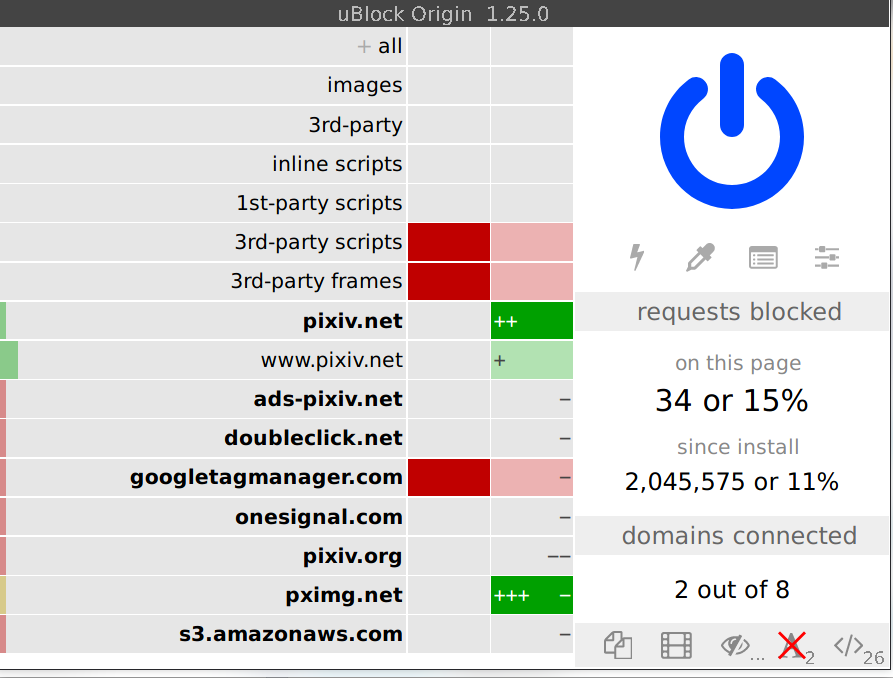

koneko
======

.. image:: https://img.shields.io/badge/License-GPLv3-blue.svg
   :target: https://www.gnu.org/licenses/gpl-3.0.txt
   :alt: GPLv3 license

.. image:: https://img.shields.io/pypi/v/koneko
   :target: https://pypi.org/project/koneko/
   :alt: PyPI

.. image:: https://img.shields.io/github/commits-since/twenty5151/koneko/latest
   :target: https://GitHub.com/twenty5151/koneko/commit/
   :alt: commits since

.. image:: https://github.com/twenty5151/koneko/workflows/master/badge.svg?branch=master
   :target: https://github.com/twenty5151/koneko/workflows/master/badge.svg?branch=master
   :alt: master

.. image:: https://readthedocs.org/projects/koneko/badge/?version=latest
    :target: https://koneko.readthedocs.io/en/latest/?badge=latest
    :alt: docs

..

   Browse pixiv in the terminal using kitty's icat to display images (or use ueberzug)

Gallery view

.. image:: ../pics/gallery_view_square_medium1.png
   :target: ../pics/gallery_view_square_medium1.png
   :alt: Gallery view_square_medium1

.. image:: ../pics/gallery_view_square_medium2.png
   :target: ../pics/gallery_view_square_medium2.png
   :alt: Gallery view_square_medium2

Image view

.. image:: ../pics/image_view.png
   :target: ../pics/image_view.png
   :alt: Image_view

Artist search (artist profile picture on the left, 3 previews on right)

.. image:: ../pics/artist_search.png
   :target: ../pics/artist_search.png
   :alt: artist_search

View artists you're following

.. image:: ../pics/following_users_view.png
   :target: ../pics/following_users_view.png
   :alt: following_users_view

Requires `kitty <https://github.com/kovidgoyal/kitty>`_. It uses the magical ``kitty +kitten icat`` 'kitten' to display images. For more info see the `kitty documentation <https://sw.kovidgoyal.net/kitty/kittens/icat.html>`_. Actually, ``lscat.py`` uses `pixcat <https://github.com/mirukana/pixcat>`_\ , which is a Python API for icat.

*New in version 0.11.0:* `ueberzug <https://github.com/seebye/ueberzug>`_ is now supported as an experimental feature, enable through the config file.

**Why the name Koneko?** Koneko (こねこ) means kitten, which is what ``icat`` is, a kitty ``+kitten``

Features (what?)
----------------

See the :ref:`manual <manual>` for more details

#. View artist illustrations (\ `ex <https://www.pixiv.net/bookmark.php?type=user>`_\ )
#. View a post (\ `ex <https://www.pixiv.net/en/artworks/78823485>`_\ )

   * View related images suggested by pixiv (ex: scroll down from the above example)

#. View the artists that you are following (or any other user ID) (\ `ex <https://www.pixiv.net/bookmark.php?type=user>`_\ )
#. Search for an artist/user (\ `ex <https://www.pixiv.net/search_user.php?nick=raika9&s_mode=s_usr>`_\ )
#. View new illustrations from all the artists you are following (\ `ex <https://www.pixiv.net/bookmark_new_illust.php>`_\ )
#. View recommended illustrations (now called 'discovery') (\ `ex <https://www.pixiv.net/discovery>`_\ )

* Navigate between next and previous pages/images
* Download images (\ `PixivUtil <https://github.com/Nandaka/PixivUtil2/>`_ would be more suitable for batch download) in full resolution
* Open post in browser
* Browse an offline cache

Why?
----

* Terminal user interfaces are minimalist, fast, and doesn't load Javascript that slows down your entire browser or track you

  * Image loading is *so* much faster, especially if you don't delete the cache

I get 32 trackers on Pixiv. Plus, you have to disable ublock if you ever get logged out

The mobile app even directly tells you Google "and our 198 partners" "collect and use data"! See `prompt 1 <https://raw.githubusercontent.com/twenty5151/koneko/master/../pics/ads1.png>`_\ , `prompt 2 <https://raw.githubusercontent.com/twenty5151/koneko/master/../pics/ads2.png>`_ (Github can't render the images correctly for some reason) and this `list <#trackers-avoided>`_

* TUIs make you cool
* TUIs *with embedded pictures* make you even cooler
* TUIs embedded with pictures of cute anime girls make you the coolest
* Keyboard driven
* Familiar, vim-like key sequences
* I use arch btw

Installation (how?)
-------------------

See also: :ref:`manual installation <manual-installation>`

#. If you want to use the stable api, install `kitty <https://github.com/kovidgoyal/kitty>`_ (Otherwise, you can use ueberzug with your current terminal, however note that it doesn't seem to work on macOS)

   * If using ueberzug, run ``pip install ueberzug`` first

#. ``pip install koneko`` (or if you use :ref:`conda <conda-environment>`...)
#. Run ``koneko``. It will open a pixiv login page in your default browser and quit.
#. Login to pixiv on your browser. If prompted, open the ``pixiv://`` link with "koneko pixiv login handler". If successful you should see a notification saying "Login finished!". If not, make a bug report at https://github.com/twenty5151/koneko/issues/
#. Run ``lscat 1 7`` to help setup the recommended settings; copy to ``~/.config/koneko/config.ini``. (Don't skip this step! Image display in the terminal is very sensitive to your config!)
#. Run ``koneko`` again. Hopefully you don't see any error messages about login failing. See the :ref:`usage manual <manual>` for how to use.

Requirements
^^^^^^^^^^^^

* Python 3.8+
* It has been tested on kitty v0.17.2 onwards, but should work on older versions
* Operating system: all OSes that kitty supports, which means Linux and macOS.

  * Ueberzug only works on linux

* Dependencies on external programs (your responsibility to install them):

  * ``xdg-open`` (linux) or ``open`` (mac) for opening links in your browser
  * ``curl`` for safety fallback (not necessarily needed), see below
  * ``xdg-mime`` and ``update-desktop-database`` to handle the pixiv login callback

    * For ``update-desktop-database``, try install the ``desktop-file-utils`` package with your package manager

.. raw:: html

   

     
If it crashes (it shouldn't), it might be because pip didn't 'install' the welcome pictures, *and* the script failed to download them for some reason. Try:

   <code>
   mkdir -p ~/.local/share/koneko/pics

   curl -s https://raw.githubusercontent.com/twenty5151/koneko/master/../pics/71471144_p0.png -o ~/.local/share/koneko/../pics/71471144_p0.png

   curl -s https://raw.githubusercontent.com/twenty5151/koneko/master/../pics/79494300_p0.png -o ~/.local/share/koneko/../pics/79494300_p0.png
    </code>
   

Usage and manual
----------------

See the :ref:`manual <manual>` here

Upcoming changelog
^^^^^^^^^^^^^^^^^^

For full changelogs please see `releases <https://github.com/twenty5151/koneko/releases>`_

Version 0.12
~~~~~~~~~~~~~~

Features
""""""""

* Custom user ID for mode 3 (view following users) has been removed, to reduce complexity of first-time setup

Bug fixes
"""""""""
* Fixed broken pixiv login

Code maintenance
""""""""""""""""

* Todo

Roadmap
-------

Features
^^^^^^^^

* Illust-related mode can't go back to image mode
* In-depth usage documentation; use letters to represent modes (at least in public docs) rather than numbers

  * Make sure the diagrams in HACKING.md is up-to-date

Known bugs
^^^^^^^^^^

* Some info (eg manual) are still being hidden by ueberzug; general unreliability of prints (need a rethink of implementation)

  * Help message that responds to terminal width
  * Consider `ucollage <https://github.com/ckardaris/ucollage/>`_

* In the logs, urllib3 warns that ``Connection pool is full, discarding connection: i.pximg.net``. See `customising pool behaviour <https://urllib3.readthedocs.io/en/latest/advanced-usage.html#customizing-pool-behavior>`_ from urllib3.

* Prefetch thread still running (downloading) hangs the entire app, even when user quits. Cannot use daemon threads as it still hangs then noisly aborts. Changing prompt.ask_quit() into a UI method so that it can pass a threading.Event() to downloads, doesn't work either as all the downloads has already been submitted to the ThreadPoolExecutor before the user is quick enough to send 'q'. The only way is to interrupt the urllib download process, which is going to be unsafe if you don't know what you're doing.
* There seems to be a delay between entering ``koneko`` and startup, but the delay is before the first line of the script even executes. Import time is fast. ``pip install`` using the wheel seems to reduce the delay. Directly running the script using ``python koneko/main.py`` or ``python koneko/lscat_app.py`` is faster as well. Seems like it's a delay in going to ``miniconda/lib/python3.8/site-packages/koneko.egg-link`` (installed with ``python setup.py develop``\ )?

Code
^^^^

* Refine ueberzug dependency in setup.py/requirements.txt, keeping in mind that ueberzug only builds on linux
* Split up UI classes and look for ways to extend data classes by adding an imperative shell around it. Possible ways to split by:

  * Whether methods need pixivrequest or not (tried this, but methods are too entangled, see :ref:`HACKING <classmethods>`\ )
  * Whether methods are for setting up, usage, or both (tried this)

    * Finite state machine of the modes (tried this; way too many classes)
    * SetupMixin and UIMixin both inherit a CommonMixin (tried this; problem is exponential explosion of number of classes)

FAQ
---

* I'm having problems with lscat

For the best experience use the terminal in full screen, unless your screen is big enough. Moving and resizing it abruptly will not be good for icat, which is really kitty's problem not mine. Extra information can be disabled from being printed.

You can also use versions less than v0.5.1, which retains legacy support for the original lsix shell script. Note that I've never really tested it, which is why I decided to be honest and depreciated legacy support from v0.6 onwards. The current lscat API has matured to the point where it's simple to write a replacement anyway.

* I'm having problems logging in

Try these steps in order:

- Update your system and reboot. No seriously, that's what worked for me.
- Try a different browser
- Set said different browser as your default browser
- Make a bug report at https://github.com/twenty5151/koneko/issues/ for support and debugging
- Use the original script `here <https://gist.github.com/ZipFile/c9ebedb224406f4f11845ab700124362>`_ to get your refresh token. Copy the example config to ``~/.config/koneko``, and add the line ``refresh_token=XXXX`` under the ``[Credentials]`` section.

Contributing
------------

#. Fork it
#. Run tests with ``pytest testing/ -vvvv -l``
#. Make your changes
#. Run tests again (add ``-s --inte`` for integration tests if you want)
#. Submit a pull request

Tips:

* See :ref:`HACKING.rst <hacking>` to understand the code.
* If your git client complains about committing to master, just remove ``.pre-commit-config.yaml``
* If you want to, you can create an issue first. Ask any questions by opening a new issue.
* If you're encountering/fixing a bug and you're stuck, try clearing the cache. For example, a bug might have downloaded to the wrong folder, but after fixing the bug, you need to clear the cache, otherwise it would not download anything and display the wrong contents.

See the rest in :ref:`CONTRIBUTING.rst <contributing>`

Unit tests
^^^^^^^^^^

Run ``pytest testing/ -vvvv -l``. Add ``-s --inte`` for integration testing, but don't be surprised if it fails, because integration tests require a valid config/account + internet connection

Build and upload to PyPI
^^^^^^^^^^^^^^^^^^^^^^^^

#. Run integration tests locally
#. Review github action logs to make sure nothing is wrong
#. Bump version info in ``__init__.py``\ , ``setup.py``\ , and ``CONTRIBUTING.md``
#. Run:

.. code-block:: sh

   # Change 1st argument to where [`plantuml.jar`](https://plantuml.com/download) is stored
   java -jar ~/Applications/plantuml.jar docs/puml/classes -o render
   python setup.py sdist bdist_wheel
   twine upload dist/*
   pip install koneko --upgrade

Trackers avoided
----------------

.. raw:: html

   

   
This is a list of trackers present when you use the official pixiv website or app. koneko frees you from them.

   Nine trackers in the Android app, according to [exodus](https://reports.exodus-privacy.eu.org/en/reports/jp.pxv.android/latest/):

   * Amazon Advertisement
   * AMoAd
   * Google Ads
   * Google CrashLytics
   * Google DoubleClick
   * Google Firebase Analytics
   * Integral Ad Science
   * Moat
   * Twitter MoPub

   Advertisers from pixiv's [privacy policy](https://policies.pixiv.net/en.html#booth):

   * Looker
   * Repro
   * Qualaroo
   * DDAI（Date Driven Advertising Initiative）
   * YourAdChoices
   * Rubicon Project
   * i-Mobile Co., Ltd.
   * Akinasista Corporation
   * Axel Mark Inc.
   * AppLovin
   * Amazon Japan G.K.
   * AmoAd Inc.
   * AOL Platforms Japan K.K.
   * OpenX
   * Google Inc.
   * CRITEO K.K.
   * CyberAgent, Inc.
   * Geniee, Inc.
   * Supership Inc.
   * GMO AD Marketing Inc.
   * F@N Communications, Inc.
   * Facebook Inc.
   * Fluct, Inc.
   * Platform One Inc.
   * MicroAd Inc.
   * MoPub Inc.
   * Yahoo! Japan Corporation
   * United, Inc.
   * 株式会社Zucks
   * PubMatic, Inc.
   * Liftoff Mobile, Inc.
   * Mobfox US LLC
   * OneSignal
   * Smaato, Inc.
   * SMN株式会社
   * 株式会社アドインテ
   

